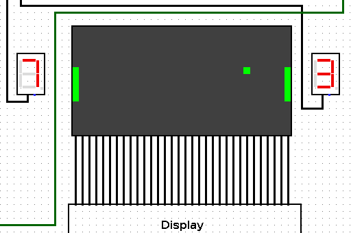

PONG
====

Implementation of the pong game without software.
https://en.wikipedia.org/wiki/Pong

-----

Use _LOGISIM_ (https://sourceforge.net/projects/circuit/files/latest/download) to play with it.
Start the clock and use the buttons UP/DOWN to move each paddle.

Possibility to run it on a FPGA by setting the input buttons and the LED screen.

Need improvements in:
* TODO: Make more random moves

Start the clock signal *clk* by selecting the clock, goto the menubar and select *Simulate*, *Tick Frequency*, *Tick Enabled*.
Set the Start signal to 1 for a clock cycle and the game should start.
Use the UP and DOWN buttons on the right and left of the screen to move the paddles.

How does it work
----------------
There are 5 major modules used for the game:
* Screen (16 x 32) to display the game. The screen is controlled by 32 registers of 16bit.
The first (0) and last (31) columns 16bit vectors are OR-ed by the output of the Paddle module. The paddles are 5 pixels long.
The ball X module output is activating or not the multiplexer for the specific column to display the Ball Y value.

* Ball X controls the horizontal output coordinate of the Ball pixel. This is a 32bit vector length that has only one bit set corresponding at the column that should be activated.
At each clock signal, there can be 4 events:
	* There is a reset, and the coordinate is set to 10
	* There is no hit and the ball is on the 0 or 31 column, act like a reset and set the default coordinate.
	* Increase/Decrease the counter, check the boundary (0 to 31), shift 1 by the value of the counter.
	* There is a hit (paddle is on the ball). The multiplexer will go in the oposite direction. If the counter was incrementing, then the counter is decrementing and vice versa.

* Ball Y is sensibly the same as Ball X. But it controls the vertical coordinate of the Ball. This is a 16bit vector length that has only one bit set corresponding at the row that should be activated.

* Paddle: Depending on the value of the associated UP/DOWN, increase/decrease the counter and check the boundary.
Paddle is 5 pixels and there is a Hit test with the Y value of the Ball coordinate.

* Reset (Restart): Set the default value for the paddle and the ball coordinate.

----

Pong written in _NIOS II assembly code_
Runs on RISC processor implemented on FPGA supporting the instructions written in the PDF.

Big file +600lines (can be broken into multiple one)

The parameters should be generic and the game can be run on different screens if those settings are changed accordingly.

This has been developed to run on a _FPGA4U_ (https://fpga4u.epfl.ch/wiki/Main_Page)
The code can be simulated using _nios2sim.jar_ (http://lap.epfl.ch/archord)
